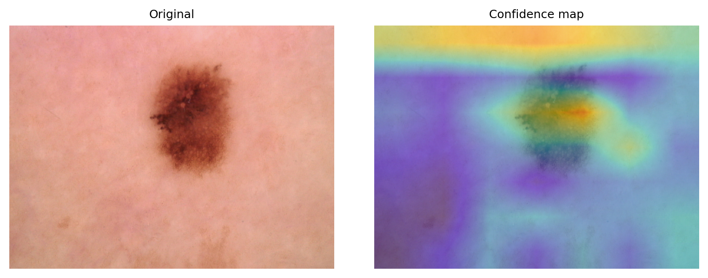
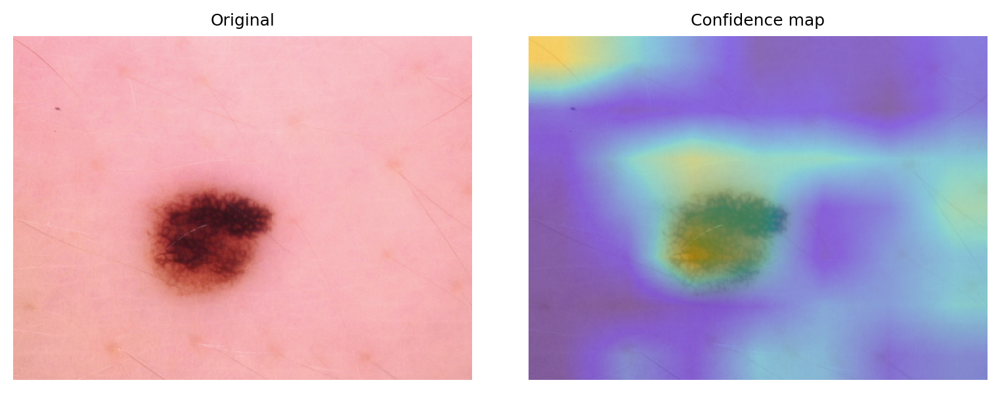

# CV8502-Assignment-1 -- HAM10000 Reliability Audit — Failure Analysis of Medical AI Systems

End-to-end notebooks for training a 7-class dermoscopy classifier on **HAM10000**, probing **failure modes** via stress tests & slices, auditing **calibration/uncertainty** (temperature scaling, risk–coverage), and producing **case studies** with Grad-CAM plus a **deployment checklist**.

## ✨ What’s inside

* **Model**: ResNet-50 head, cross-entropy + label smoothing (0.1), optional MixUp (α=0.2), cosine LR.
* **Evaluation**: AUROC, AUPRC, macro-F1, and **Sens@95%Spec** safety operating point.
* **Robustness**: corruptions (noise/blur/JPEG/brightness–contrast), domain shifts (color cast, down→up), and slices (brightness quartiles, image size).
* **Calibration**: temperature scaling; reliability diagrams; **risk–coverage** for selective prediction.
* **Case studies**: Grad-CAM overlays, diagnosis/mitigation/residual risk; deployment checklist.
* **Repro pack**: exact seeds, env, commands, and auto-logged artifacts.

---

## 📁 Repository layout

```
.
├── Assignment-1.ipynb     # Alternate full pipeline (ResNet50 + label smoothing + MixUp)
├── Assignment-Output/
│   └── Assignment-01-Output/
│       └── taskE/
│           ├── case_1_panel.png             # Case study panels (original + Grad-CAM)
│           └── case_2_panel.png
└── outputs_alt/
    └── ham_alt_YYYYMMDD_HHMMSS/             # Auto-created per run
        ├── metrics_clean.json
        ├── metrics_corruptions.json
        ├── metrics_shifts.json
        ├── metrics_slices.json
        ├── delta_corruptions.json
        ├── delta_shifts.json
        ├── delta_slices.json
        ├── calibration.json                 # T, ECE/Brier (pre/post)
        ├── risk_coverage_summary.json
        ├── cases.json
        └── figs/
            ├── reliability_before.png / reliability_after.png
            ├── risk_coverage_marked.png
            ├── corruptions_severity_lines.png
            ├── domain_shifts_bars.png
            ├── slices_bars.png
            ├── confusion_matrix_clean.png
            └── prcurve_melanoma.png
```

> Paths under `Assignment-Output/.../taskE/` are the panels you generated for Task E; keep them under version control so the report builds reproducibly.

---

## 🧰 Setup

```bash
# Create & activate env
conda create -n ham-audit python=3.10 -y
conda activate ham-audit

# Install PyTorch (CUDA 12.1 wheel; change if needed), then deps
pip install --index-url https://download.pytorch.org/whl/cu121 torch torchvision
pip install numpy pandas scikit-learn pillow matplotlib tqdm opencv-python pyyaml
```

**Dataset**: Download HAM10000 (metadata CSV + two image folders). Your tree should contain:

```
HAM10000/
├── HAM10000_metadata.csv
├── HAM10000_images_part_1/*.jpg
└── HAM10000_images_part_2/*.jpg
```

---

## 🚀 Quickstart (Jupyter)

1. Open **`HAM10000_Reliability_Audit_ALT.ipynb`**.
2. Set `DATA_ROOT` to your HAM10000 path.
3. Run **Kernel → Restart & Run All**.

The notebook will:

* train (ResNet-50, 224×224), pick best checkpoint by val AUROC,
* evaluate clean and robustness suites,
* fit temperature scaling,
* compute risk–coverage,
* export metrics/figures under `Assignment-Output/.../`,
* generate case studies and LaTeX snippets (optional cells).

---

## 📊 Key results (from your latest run)

**Calibration**
Fitted temperature **T = 0.8212406635**
ECE: **0.0490316 → 0.0359301**, Brier: **0.3757681 → 0.3736223** (lower is better).

**Corruptions (AUROC / macro-F1 / Sens@95%Spec)**

* Gaussian noise s1: **0.8972 / 0.2874 / 0.0045**; s2: 0.8949 / 0.3006 / 0.0000; s3: 0.8669 / 0.2922 / 0.0000
* Gaussian blur s1: **0.8997 / 0.2790 / 0.0090**; s2: 0.8970 / 0.2544 / 0.0090; s3: 0.8940 / 0.2154 / 0.0090
* JPEG s1: **0.8984 / 0.2852 / 0.0090**; s2: 0.8985 / 0.2821 / 0.0090; s3: 0.8967 / 0.2999 / 0.0045
* **Brightness/contrast** s1: **0.8831 / 0.2914 / 0.0000**; s2: 0.8124 / 0.2372 / 0.0090; **s3: 0.7426 / 0.1622 / 0.0180 (worst)**

**Domain shifts**

* Color cast: **AUROC 0.8623**, F1 **0.2338**, Sens 0.0045
* Down–up sample: AUROC 0.8995, F1 0.2796, Sens 0.0090

**Slices**

* Brightness Q1: AUROC **0.9168**, F1 0.3257, Sens 0.0000
* Brightness Q2: AUROC 0.8991, **F1 0.2322 (lowest)**, Sens 0.0000
* Brightness Q3: AUROC 0.8844, F1 0.2548, Sens 0.0000
* **Brightness Q4**: **AUROC 0.8700 (lowest)**, F1 0.2541, **Sens 0.0571 (highest but still low)**
* ImageSize Q1: AUROC 0.8986, F1 0.2824, Sens 0.0045

**Takeaway**: Photometric slices (especially **bright Q4**) and **brightness/contrast** corruption (s3) break the model; the **Sens@95%Spec** safety point is fragile across slices → use **temperature scaling + selective prediction** and photometric normalization.

---

## 🧪 Reproducing figures

All figures are saved in `Assignment-Output/.../figs/`. Include them in LaTeX/markdown as needed, e.g.:

```markdown

```

(Or, for your Task E panels:)

```markdown


```

---

## 📝 Case studies (Task E)

* **Case 1 — ISIC_0025316**: GT *mel*, Pred *nv*, confidence **93.17%**. Diagnosis: *scale/blur-induced*.
  [Panel](Assignment-Output/Assignment-01-Output/taskE/case_1_panel.png)

* **Case 2 — ISIC_0028760**: GT *mel*, Pred *nv*, confidence **92.14%**. Diagnosis: *scale/blur-induced*.
  [Panel](Assignment-Output/Assignment-01-Output/taskE/case_2_panel.png)

**Mitigation**: anti-aliased resize, higher input resolution / mild super-resolution, stronger blur augmentation; lesion-centric crops to reduce background bias.
**Residual risk**: low-contrast/atypical melanomas can still be missed; route abstentions/positives to human review.

---

## 🔁 Reproducibility notes

* **Splits**: stratified **70/10/20** (val = 12.5% of trainval). `SEED=1234`.
* **Training**: ResNet-50 @ 224, AdamW (1e-4, wd 1e-4), cosine anneal, bs=32, epochs=10, label smoothing 0.1, MixUp α=0.2.
* **Calibration**: temperature scaling (LBFGS), **T=0.8212**; ECE and Brier as above.
* **Uncertainty**: MC-Dropout 0.3 (20 passes) (optional).
* **Artifacts**: see `Assignment-Output/<run_id>/*.json` and `figs/`.

For a machine-readable log of env/config, run the “Reprolog” cell to generate `repro.json`.

---

## 📚 Citation

* Tschandl P, Rosendahl C, Kittler H. *The HAM10000 dataset: A large collection of multi-source dermatoscopic images of common pigmented skin lesions.* **Sci Data** 2018.

---

## 🙌 Acknowledgements

Thanks to the creators of HAM10000 and the open-source PyTorch ecosystem.
